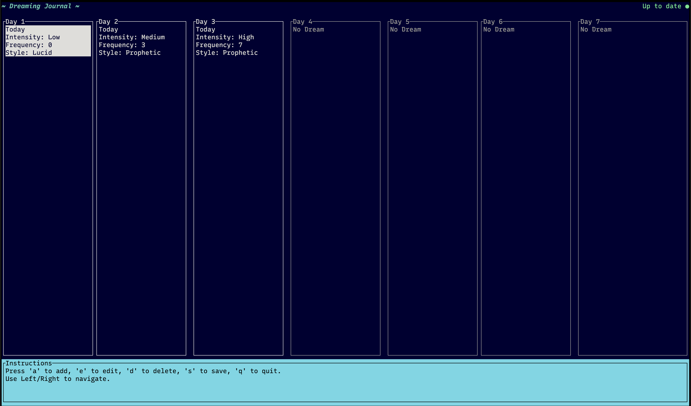
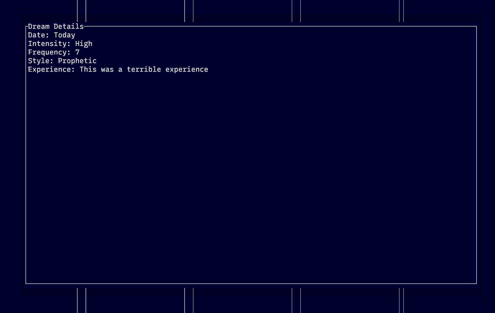

# Dreaming

An interactive, terminal-based dream journal application built in Rust. Record, edit, and track your dreams with an intuitive Text User Interface (TUI).


## Features

- **Add Dreams**: Record new dreams with details like intensity, frequency, style, and experience.
- **Edit Dreams**: Modify existing dream entries.
- **Delete Dreams**: Remove dreams from your journal.
- **View Dream Details**: Display detailed information about each dream.
- **Unsaved Changes Indicator**: Visual cue indicating unsaved changes.
- **Export Dreams**: Save your dreams to a JSON file for backup or analysis.
- **Scrollable Dream List**: Navigate through an unlimited number of dreams.
- **Intuitive Interface**: Easy-to-use keyboard controls.
- **Theming**: Dark blue background with a light blue instructions panel.

## Installation

### Prerequisites

- **Rust**: Ensure you have Rust and Cargo installed. You can install Rust using [rustup](https://www.rust-lang.org/tools/install):

  ```bash
  curl --proto '=https' --tlsv1.2 -sSf https://sh.rustup.rs | sh
  ```

### Install from GitHub

If the package is not published on crates.io, you can install it directly from the GitHub repository:

```bash
cargo install --git https://github.com/Warkanlock/dreaming.git
```

### Build from Source

1. **Clone the Repository**

   ```bash
   git clone https://github.com/Warkanlock/dreaming.git
   cd dreaming
   ```

2. **Build the Application**

   ```bash
   cargo build --release
   ```

3. **Run the Application**

   ```bash
   ./target/release/dreaming
   ```

## Usage

Run the application from your terminal:

```bash
dreaming
```

### Controls

- **Add a Dream**: Press **`a`** and follow the prompts.
- **Edit a Dream**: Select a dream using **Left/Right** arrow keys and press **`e`**.
- **Delete a Dream**: Select a dream and press **`d`**.
- **Save Dreams**: Press **`s`** to save (export) your dreams.
- **View Dream Details**: Select a dream and press **`Enter`**.
- **Navigate Dreams**: Use **Left/Right** arrow keys.
- **Quit Application**: Press **`q`** and confirm.

### Dream Attributes

- **Intensity**: `Low`, `Medium`, `High`
- **Frequency**: A number between `0` and `10`
- **Style**: `Lucid`, `Nightmare`, `Recurring`, `Prophetic`, `Normal`
- **Experience**: A textual description of the dream

## Screenshots


*Main interface showing the list of dreams.*


*Viewing dream details.*

## Data Persistence

- Dreams are saved in `dreams.json` when you choose to save them by pressing **`s`**.
- An unsaved changes indicator (●) appears in red when there are unsaved changes and turns green when all changes are saved.

## Contributing

Contributions are welcome! Please follow these steps:

1. **Fork the Repository**
2. **Create a New Branch**

   ```bash
   git checkout -b feature/your-feature-name
   ```

3. **Make Your Changes**
4. **Commit Your Changes**

   ```bash
   git commit -m "Add some feature"
   ```

5. **Push to the Branch**

   ```bash
   git push origin feature/your-feature-name
   ```

6. **Open a Pull Request**

## License

This project is licensed under the MIT License - see the [LICENSE](LICENSE) file for details.

## Contact

For questions or suggestions, feel free to open an issue.

## Acknowledgments

- Built with [Rust](https://www.rust-lang.org/) and [ratatui](https://github.com/tui-rs-revival/ratatui).
- Inspired by the need for a simple and interactive dream journaling tool for my personal use.
